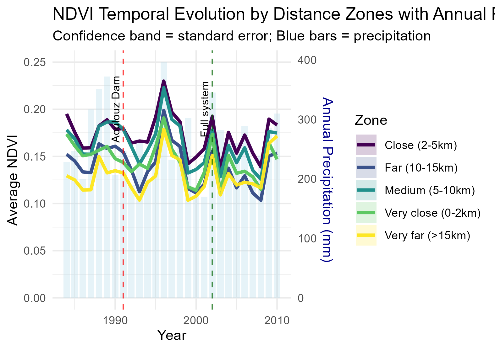
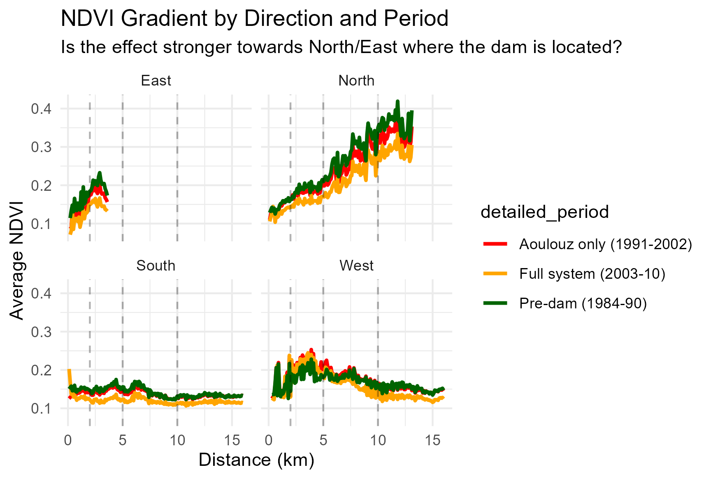

# Water Infrastructure and Agricultural Productivity: Evidence from Morocco's Aoulouz Dam

[](https://www.python.org/downloads/)
[](https://www.r-project.org/)

This repository contains the data collection and analysis pipeline for studying the impact of water infrastructure on agricultural productivity in Morocco's Souss Valley.

## 📋 Research Question

**How does water infrastructure modify the relationship between precipitation and agricultural productivity?**

We analyze the construction of Morocco's Aoulouz Dam (1991) using satellite data and econometric methods to identify effects on agricultural outcomes. This preliminary analysis focuses on the first dam's impact during 1984-1997.

## 🎯 Contributions

- **High-resolution satellite analysis**: 14-year panel dataset (1984-1997) with 30m spatial resolution  
- **Infrastructure impact analysis**: Analysis effects of dam construction on agricultural productivity
- **Climate adaptation insights**: Quantifies how infrastructure modifies climate vulnerability

## 📊 Data Sources

| Data Type | Source | Resolution | Period | Purpose |
|-----------|--------|------------|---------|---------|
| **Vegetation (NDVI)** | Landsat 5 Collection 2 | 30m, monthly | 1984-1997 | Agricultural productivity proxy |
| **Precipitation** | CHIRPS | ~5km, daily | 1984-1997 | Climate controls |
| **Infrastructure** | Historical records | Point data | 1991 | Treatment timing |

## 🏗️ Repository Structure

```
├── DataCollection.ipynb          # Python/GEE data     collection pipeline
├── requirements.txt              # Python dependencies  
├── 01.Calculate_NDVI_Landsat_5.R # NDVI calculation
├── 02.1.ndvi_extraction.R        # Spatial extraction
├── 03.data_vis.R                 # Exploratory analysis
├── 04.model.R                    # Causal identification 
└── readme.md

```

### Prerequisites

- **Python 3.8+** with Google Earth Engine access
- **R 4.0+** with spatial packages
- **Google Earth Engine account** (for data collection)
- **QGIS** (for spatial grid creation)

### Installation

1. **Clone the repository**
   ```bash
   git clone https://github.com/your-username/morocco-water-infrastructure.git
   cd morocco-water-infrastructure
   ```

2. **Set up Python environment**
   ```bash
   pip install -r requirements.txt
   ```

3. **Install R packages**
   ```r
   # Install required R packages
   install.packages(c("terra", "sf", "fixest", "modelsummary", 
                      "tidyverse", "ggplot2", "viridis"))
   ```

4. **Configure Google Earth Engine**
   ```python
   import ee
   ee.Authenticate()  # Follow authentication prompts
   ```

### Usage Workflow

#### Step 1: Data Collection (Python/GEE)
```bash
# Run the data collection notebook
jupyter notebook DataCollection.ipynb
```

**What it does:**
- Identify a point and creates a buffer zone
- Downloads Landsat 5 imagery for NDVI calculation (1984-1997)
- Collects CHIRPS precipitation data
- Applies cloud masking and quality filters

#### Step 2: NDVI Processing (R)
```r
# Calculate NDVI from Landsat bands
source("01.Calculate_NDVI_Landsat_5.R")
```

**What it does:**
- Processes Red and NIR bands to calculate NDVI
- Creates monthly composites
- Generates quality control statistics

#### Step 3: Spatial Extraction (R)
```r
# Extract NDVI by 200m grid cells
source("02.1.ndvi_extraction.R")
```

**What it does:**
- Extracts NDVI statistics (for this research a grid with 200m × 200m cells was created)
- Calculates distances of each polygon centroid to the dam
- Builds panel dataset structure

#### Step 4: Plots (R)
```r
# Create data visualization
source("03.data_vis.R")
```
**What it does:**
- Generates figures and plots 
- Explore different relations of the variables

#### Step 4: Analysis (R)
```r
# Run econometric analysis
source("04.model.R")
```

**What it does:**
- Implements difference-in-differences identification
- Generates tables 

## 📈 Key Methodology

### Identification Strategy

Our identification exploits two main sources of variation:

1. **Spatial**: Distance to Aoulouz Dam (treatment intensity)
2. **Temporal**: Pre-dam (1984-1990) vs. Post-dam (1991-1997) periods  
3. **Climatic**: Annual precipitation variation for elasticity analysis

### Core Econometric Model

```
NDVI_it = α_i + δ_t + β₁(Near × Post) + β₂(Precip × Near × Post) + γX_it + ε_it
```

Where:
- `β₁` captures direct infrastructure effects
- `β₂` captures changes in precipitation sensitivity 
- `α_i` = pixel/cell fixed effects, `δ_t` = year fixed effects

## 📊 Sample Outputs

### Temporal Evolution by Distance Zones


### Spatial Heterogeneity Maps  


*Note: figures generated after running the analysis pipeline*

